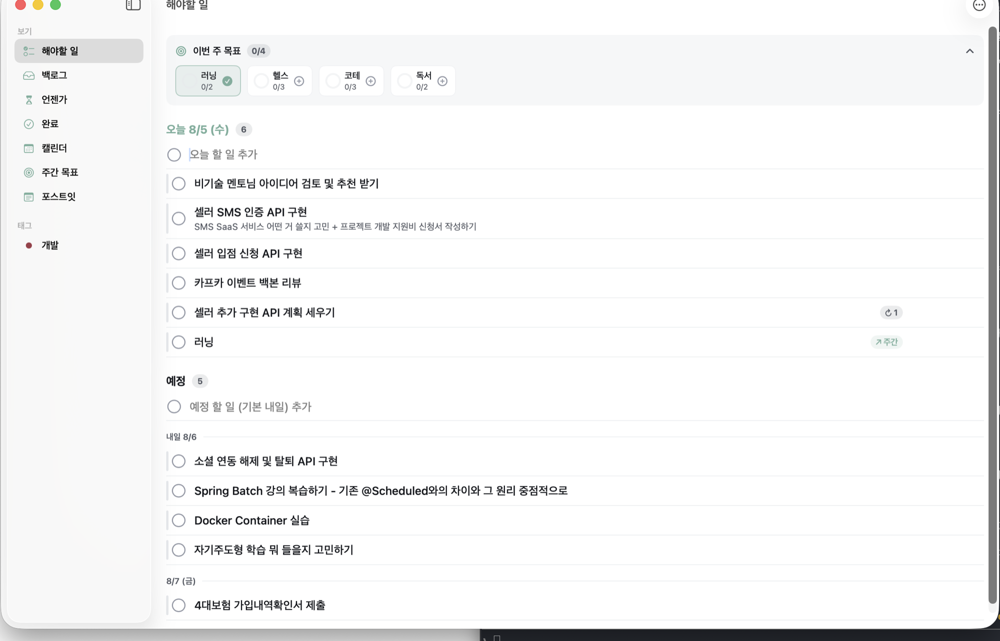

# AnhamDie

**하루를 관리하는 macOS 메뉴바 투두 앱.** 자정이 아니라 내가 정한 시각에 하루가 시작되고,
어제 못 끝낸 일은 아침에 물어보고 넘겨준다. 화면 맨 앞 플로팅 오버레이, 포스트잇, 주간 목표,
색상 테마까지 — 로컬 전용, 동기화·알림(푸시) 없음.



`macOS 15+` · UI 한국어 · 외부 의존성 1개(KeyboardShortcuts) · MIT

## 설치

```bash
brew install splguyjr/tap/anhamdie
```

설치가 끝나면 **`/Applications/AnhamDie.app`에 자동 설치**된다 — 실행하면 메뉴바에 상주한다.
업데이트는 `brew upgrade anhamdie`, 제거는 `brew uninstall anhamdie`(앱까지 함께 제거).

> 소스에서 로컬 빌드하는 cask라 첫 설치에 1~2분 걸린다(Command Line Tools 필요 — brew
> 사용자는 이미 있음). 로컬 빌드 산출물이라 Gatekeeper 격리·경고 없이 바로 실행된다.

## 한눈에 보는 기능

- **논리적 하루 + 아침 브리핑** — 하루가 자정이 아닌 기준 시각(기본 09:00)에 시작. 앱 시작·잠자기
  해제·기준 시각 도달 시 하루 한 번, 어제 못 끝낸 일을 [오늘로 / 백로그 / 버리기]로 정리시킨다.
- **플로팅 오버레이** — 오늘 할 일만 담은 작은 카드를 모든 화면·전체화면 위에 띄운다. 클릭 한 번으로 완료.
- **사이드바형 메인 창** — 해야할 일(지난·오늘·예정) / 백로그 / 언젠가 / 완료 / 캘린더 / 주간 목표 / 포스트잇 / 태그.
- **캘린더 월·주·일 뷰** — 드래그로 일정 변경, 우측 날짜 패널 폭 조절, 주간 뷰에 그 주 목표 진행 표시.
- **주간 목표** — "헬스 3회" 같은 주 단위 목표를 등록하고, [오늘 하기]로 오늘에 배치하면 완료 시 진행도가 자동으로 오른다. 매주 반복(루틴) 지원.
- **'언젠가' 리스트** — Due 없이 여유될 때 해나가는 일들. 오늘로 꺼냈다가 안 하면 부담 없이 다시 돌아간다.
- **포스트잇** — 투두와 별개의 스티키 노트. 개별 창·색상·핀, 닫으면 보관함에 남는다.
- **색상 테마** — 프리셋 9종 + 12색 슬롯을 직접 편집하는 커스텀 테마.
- **빠른 입력** — 어디서든 단축키로 `보고서 #업무 !높음 내일` 같은 토큰 문법으로 즉시 추가.
- **글로벌 단축키** — IntelliJ 등 지정 앱이 활성일 때는 자동으로 양보한다.

## 화면과 기능

### 메인 창 — 사이드바형 (Things 스타일)

좌측 사이드바의 스마트 뷰 + 태그 목록(클릭 시 해당 태그로 필터)으로 구성된다.

- **해야할 일**: **① 지난 할 일 · ② 오늘 · ③ 예정** 3개 섹션을 한 화면에서 스크롤. 예정은 큰 섹션으로
  쪼개지 않고 하나의 연속 리스트로 묶되 내부에 가벼운 미니 날짜 구분선("내일 8/6", "8/7 (금)")으로 나눈다.
  상단에 이번 주 목표 진행 요약 카드(접기 가능).
- **날짜 간 이동**: 리스트에서 task를 다른 날짜 그룹으로 드래그하면 일정이 바뀌고, 같은 그룹 내 드래그는
  수동 정렬이다. 우클릭 오늘로/내일로/날짜 선택도 병행.
- **백로그 / 언젠가 / 완료**: 백로그는 보류(날짜 없이 밀어둔 것), 언젠가는 여유될 때 해나가는 목록,
  완료는 날짜별 그룹 히스토리(취소 항목은 '오늘로 복구' 가능).
- 행에는 체크박스·제목·메모 미리보기 한 줄·D-day 배지·이월 배지(↺n). **우선순위는 행 왼쪽 세로 색 막대**,
  **태그는 글자 칩(TagPill)**으로 한눈에 구별된다.

### 플로팅 오버레이

오늘 할 일만 담은 작은 카드를 모든 Spaces·전체화면 앱 위에 띄운다. 진행률 헤더, 자유 리사이즈,
오늘 할 일을 다 끝내면 '언젠가'에서 몇 개를 꺼내 보여주는 여유 칸. 클릭 규칙은
**체크 원 = 완료(1.5초 유예, 재클릭 취소) · 행/헤더 = 메인 창 열기**. 창 이동은 헤더 드래그,
행 드래그는 수동 정렬. 재시작 후 표시 여부·위치·크기 복원.

### 캘린더 — 월 / 주 / 일

상단 세그먼트로 전환(오늘·◀·▶는 현재 뷰 단위로 이동). 월간은 셀당 task 여러 개+"+N",
주간은 일~토 7열에서 **열 간 드래그로 일정 변경**, 일간은 전폭 리스트. 우측 날짜 패널은 경계
드래그로 폭 조절되고 제목은 최대 2줄로 줄바꿈. 월간·주간 헤더에 그 주의 목표 진행 스트립.

### 주간 목표

"헬스 3회"(횟수형)·"책 1챕터"(단일형) 같은 목표를 **논리적 주**(기본 월요일 시작) 단위로 관리한다.

- **[오늘 하기]** → 오늘에 연결 task 생성(↗주간 배지). 그 task를 완료하면 목표 진행도 자동 +1, 취소하면 -1.
  다시 누르면 오늘에서 해제. 사이드바·해야할 일 요약 카드·브리핑 세 곳에서 조작할 수 있다.
- **루틴(↻)**: 매주 자동으로 0/n부터 재생성. 비루틴 미달 목표는 새 주 첫 브리핑의 '지난주 리뷰'에서
  [잔여량만 이월 / 보류 / 종료]로 정리한다.

### 포스트잇 스티키 노트

투두와 별개의 빠른 메모 레이어. 노트마다 독립 플로팅 카드(자유 이동·리사이즈, 클래식 5색),
**📌 핀**을 켜면 그 노트만 항상 위. 닫으면 삭제가 아니라 보관 — 사이드바 '포스트잇' 뷰에서
날짜별로 조회·다시 열기·다중 선택 삭제. 빈 내용으로 닫으면 저장하지 않는다.

### 색상 테마

프리셋 9종(기본/세피아/포레스트/오션/라벤더/모노/하이콘트라스트/다크/미드나잇)을 고르거나,
아무 테마나 **복제해서 12색 슬롯**(배경/표면/텍스트/강조/D-day 등)을 직접 편집해 나만의 테마를
여러 개 저장한다. 강조색은 ColorPicker로 따로 지정. 변경은 앱 전역에 즉시 반영되고, 모든 색이
현재 테마에서 해석된다(모노는 overdue 빨강만 남기고 전부 무채색). 모든 프리셋은 WCAG 대비 기준으로 검증돼 있다.

## 글로벌 단축키 (설정에서 변경 가능)

| 단축키 | 동작 |
|---|---|
| ⌥⌘T | 브리핑 패널 표시/숨김 (항상 즉시) |
| ⌥⌘O | 플로팅 오버레이 표시/숨김 |
| ⌥⌘N | 빠른 추가 입력창 |
| ⌥⌘M | 메인 창 열기/닫기 토글 |
| ⌥⌘S | 새 포스트잇 (즉시 생성 + 입력 포커스) |
| ⌥⌘H | 열린 포스트잇 전체 표시/숨김 토글 |
| ⌥⌘L | '언젠가' 리스트 패널 표시/숨김 토글 |

지정 앱(기본 JetBrains 계열)이 활성일 때는 전역 단축키가 자동으로 양보한다. 마스터 on/off와
단축키별 on/off, 재지정을 설정에서 제공한다.

## 행 사용성 (메인 창)

클릭-펼침에 의존하지 않고 행에서 바로 처리한다:

- **호버 인라인 액션**: 행 우측에 날짜 / 우선순위 / 태그 / 삭제 아이콘
- **우클릭 컨텍스트 메뉴**: 상세 열기/닫기 / 이름 편집 / 오늘로 / 내일로 / 날짜 선택 / 우선순위 / 태그 / 백로그로 / 삭제
- **더블클릭 제목 = 인라인 편집**. 상세 펼침(메모/서브태스크/마감일)은 유지

행을 선택한 상태의 키보드 단축키:

| 키 | 동작 |
|---|---|
| ⌫ | 삭제 |
| Enter | 상세 펼침/접기 |
| ⌘1 / ⌘2 / ⌘3 | 우선순위 높음 / 보통 / 낮음 |
| ⌘T | 오늘로 이동 |
| ⌘D | 내일로 이동 |

## 빠른 추가 토큰 문법 (⌥⌘N)

입력창에 제목과 토큰을 섞어 쓰면 실시간으로 파싱되어 아래 칩 행에 표시된다.
Enter 시 토큰이 제거된 제목으로 저장된다. (메인 창 인라인 추가행에서도 동일하게 동작.)

| 토큰 | 의미 |
|---|---|
| `#태그명` | 태그 지정. 입력 중 자동완성(부분일치), 없는 태그는 등록 시 생성 |
| `!높음` `!보통` `!낮음` (또는 `!1` `!2` `!3`) | 우선순위. 여러 개면 마지막이 이김 |
| `오늘` `내일` `모레` | 상대 날짜 (논리적 하루 기준) |
| `M/d` `M월 d일` `M월d일` | 절대 날짜 — 이미 지난 날짜면 내년으로 해석 |

예: `보고서 초안 #업무 !높음 내일` → 제목 "보고서 초안", 태그 업무, 우선순위 높음, 내일.
빠른 버튼 행 **[오늘] [내일] [최근 M/d] [백로그]**로도 지정할 수 있다.

## 논리적 하루와 이월

이 앱의 하루는 자정이 아니라 **기준 시각(기본 09:00, 설정 가능)**에 시작한다. 새벽 2시에
작업 중이라면 아직 "어제"다. 앱 시작 / 잠자기 해제 / 기준 시각 도달 중 하나라도 논리적 오늘이
마지막 브리핑 날짜보다 앞서면, 브리핑이 하루 한 번 자동으로 뜬다. 어제 미완료 작업을 각각:

- **오늘로 가져오기** — `scheduledDate`를 오늘로, 이월 횟수 +1 (↺n 배지)
- **백로그로 보류** — 날짜 없는 백로그로 이동
- **버리기** — 삭제가 아니라 '취소됨' 상태로 히스토리에 보관 (복구 가능)

⌥⌘T로 부른 브리핑은 판단 없이 항상 표시된다. ↺n 배지는 **진짜 이월**(이전 예정일 미완료 →
'오늘로 가져오기')에서만 오르고, 백로그로 보내는 모든 경로는 카운트를 0으로 리셋한다 — 백로그는
'미룬 날'이 없으므로 다시 오늘로 가져와도 ↺가 뜨지 않는다.

## 설정 항목

- **일반**: 로그인 시 자동 실행 / Dock 아이콘 표시 / 하루 기준 시각(기본 09:00) /
  주 시작 요일(기본 월요일) / 메모 미리보기 표시
- **단축키**: 마스터 on/off → 개별 on/off + 재지정 → 예외 앱 목록(기본 JetBrains 계열)
- **오버레이**: 배경 불투명도 / 여유 칸 표시·개수
- **테마**: 프리셋 9종 + 커스텀 테마 편집기 + 강조색 ColorPicker
- **태그**: 이름·색상 관리

## 데이터 저장 위치

로컬 전용, 동기화 없음.

- 투두·태그·주간 목표: `~/Library/Application Support/AnhamDie/store.json`
- 포스트잇: `~/Library/Application Support/AnhamDie/stickies.json` (자체 버전·백업 규약)
- 설정: `UserDefaults` (`com.splguyjr.anhamdie`)

두 스토어 모두 스키마 버전과 손상 시 `.corrupt` 백업 규약을 갖는다.

## 빌드 (직접)

```bash
git clone https://github.com/splguyjr/anham-die.git && cd anham-die
bash Scripts/build-app.sh --install   # → ~/Applications/AnhamDie.app
open ~/Applications/AnhamDie.app
```

`swift build -c release` → .app 번들 조립(LSUIElement, min macOS 15) → ad-hoc 서명 → 설치.
외부 의존성은 KeyboardShortcuts 하나. 테스트는 `swift test`.

> 참고: 1차 SPM 산출물은 KeyboardShortcuts 리소스 번들 위치 제약으로 codesign seal 검증에
> 실패하며, 이 경우 '로그인 시 자동 실행'(SMAppService)이 조용히 안 될 수 있다. 자동 실행이
> 필요하면 정식 Xcode로 `Scripts/build-with-xcode.sh --install` 산출물을 쓰면 된다.

## 라이선스

MIT — [LICENSE](LICENSE) 참고.
