# AnhamDie

**하루를 관리하는 macOS 메뉴바 투두 앱.** 자정이 아니라 내가 정한 시각에 하루가 시작되고,
어제 못 끝낸 일은 아침에 물어보고 넘겨준다. 화면 맨 앞 플로팅 오버레이, 데스크톱 위젯,
포스트잇, 주간 목표, 색상 테마까지 — 로컬 전용, 동기화·알림(푸시) 없음.


`macOS 15+` · UI 한국어 · 런타임 의존성 1개(KeyboardShortcuts) · MIT

## 설치

```bash
brew install splguyjr/tap/anhamdie
```

**`/Applications/AnhamDie.app`에 자동 설치**된다 — 실행하면 메뉴바에 상주한다.
업데이트는 `brew upgrade anhamdie`, 제거는 `brew uninstall anhamdie`(앱까지 함께 제거).

> 소스에서 로컬 빌드하는 cask라 첫 설치에 1~2분 걸리고(Command Line Tools 필요 — brew
> 사용자는 이미 있음), Gatekeeper 격리·경고 없이 바로 실행된다. 데스크톱 위젯까지 쓰려면
> [직접 빌드](#빌드-직접)가 필요하다.

## 한눈에: 8개의 표면

큰 창 하나에 갇힌 앱이 아니다. 메뉴바에 상주하면서, 필요한 곳에 필요한 만큼의 표면을 띄운다.

| 표면 | 여는 법 | 하는 일 |
|---|---|---|
| **메인 창** | ⌥⌘M · Dock/메뉴바 | 사이드바로 모든 뷰 관리 — 할 일·캘린더·주간 목표·포스트잇 |
| **메뉴바 팝오버** | 메뉴바 아이콘 클릭 | 오늘 할 일 즉시 체크 + 주요 기능 바로가기 |
| **플로팅 오버레이** | ⌥⌘O | 오늘 할 일 카드를 모든 화면·전체화면 위에 |
| **아침 브리핑** | 하루 1회 자동 · ⌥⌘T | 어제 미완료 정리 + 오늘 체크 + 주간 목표 |
| **빠른 추가** | ⌥⌘N | 어디서든 토큰 문법으로 즉시 추가 |
| **'언젠가' 패널** | ⌥⌘L | 날짜 없는 할 일 목록을 어디서든 |
| **포스트잇** | ⌥⌘S | 투두와 별개의 독립 스티키 노트 카드 |
| **데스크톱 위젯** | 위젯 갤러리 | 앱을 열지 않고 오늘 확인·완료 체크 |

전역 단축키는 설정에서 재지정·개별 on/off 할 수 있고, 예외 앱(기본 JetBrains 계열)이
활성일 때는 자동으로 양보한다.

## 이 앱만의 것

- **논리적 하루** — 하루가 자정이 아닌 기준 시각(기본 09:00)에 시작한다. 새벽 2시 작업은 아직 "어제"다.
- **아침 브리핑** — 하루 한 번, 어제 못 끝낸 일을 [오늘로 / 백로그 / 버리기]로 정리하고 시작한다.
- **정직한 이월 카운트** — ↺n 배지는 진짜 미룬 것만 센다. 백로그 보류는 리셋, '언젠가' 왕복은 이력을 남기지 않는다.
- **'언젠가' 왕복** — 여유될 때 할 일을 오늘로 꺼냈다가, 안 하면 벌점 없이 조용히 '언젠가'로 돌아간다.
- **주간 목표 ↔ 오늘 연결** — "헬스 3회"를 [오늘 하기]로 오늘에 배치하면 완료 시 진행도가 자동으로 오른다.
- **완전 로컬** — 계정·동기화·서버 없음. JSON 두 파일이 전부다.

## 화면 투어

### 메인 창 — ⌥⌘M

좌측 사이드바(해야할 일 · 백로그 · 언젠가 · 완료 · 캘린더 · 주간 목표 · 포스트잇 + 태그
필터)와 우측 뷰로 구성된 본체 창. 창 위치·크기·마지막 선택 뷰까지 복원된다.

#### 해야할 일

① 지난 할 일 ② 오늘 ③ 예정 3섹션을 한 화면에서 스크롤한다. 예정은 미니 날짜
구분선("내일 9/8" 등)으로 나뉜 연속 리스트. 상단에 이번 주 목표 요약 카드(접기 가능).

- **인라인 추가**: 각 섹션의 추가 행에서 `#태그 !높음 내일` 토큰 문법이 그대로 동작하고, 파싱 결과가 칩으로 실시간 미리보기된다.
- **드래그 하나로 정렬과 일정 변경**: 같은 날짜 그룹 안에서는 수동 정렬, 다른 날짜 그룹·구분선으로 옮기면 일정 변경. 순서는 오버레이·브리핑·위젯까지 공유된다.
- **행에서 바로 처리**: 호버 인라인 액션(날짜/우선순위/태그/삭제), 우클릭 메뉴(오늘로/내일로/날짜 선택/백로그로/언젠가로/…), 더블클릭 제목 = 인라인 편집.
- **행 상세**(Enter로 펼침): 메모 · 서브태스크 체크리스트(진행률이 행에 표시) · 마감일 · 반복 규칙 · 태그 · 우선순위.
- **완료 유예 1.5초**: 체크해도 즉시 사라지지 않고 취소선으로 잠시 남는다 — 다시 클릭하면 취소.

행에 붙는 표시들:

| 표시 | 의미 |
|---|---|
| 왼쪽 세로 색 막대 | 우선순위 (높음/보통/낮음) |
| 태그 칩 | 최대 3개, 넘치면 +N |
| ↺n | 이월 횟수 — '오늘로 가져오기'한 진짜 이월만 카운트 |
| ↻ | 반복 할 일 (매일/평일/매주) |
| ⏳ 여유 | '언젠가'에서 오늘로 꺼낸 항목 |
| ↗ 주간 | 주간 목표 연결 — 클릭하면 진행률 팝오버 |
| D-n | 마감일 D-day (논리적 하루 기준) |

행을 선택한 상태의 키보드: ⌫ 삭제 · Enter 상세 · ⌘1/⌘2/⌘3 우선순위 · ⌘T 오늘로 · ⌘D 내일로.

행 상세를 펼치면 그 자리에서 메모 · 서브태스크 · 마감일 · 태그 · 우선순위 · 반복 규칙을 편집한다:

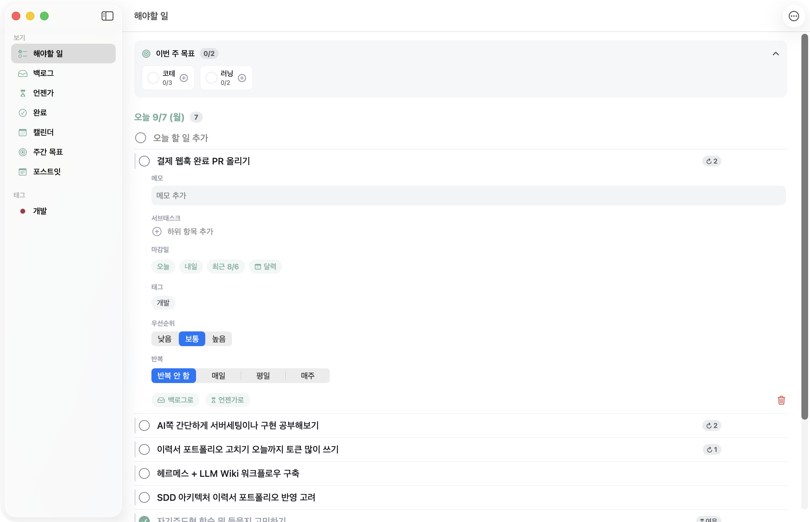

#### 백로그 · 언젠가 · 완료

**백로그**는 날짜 없이 보류한 일, **언젠가**는 여유될 때 해나가는 목록, **완료**는 날짜별
그룹 히스토리다(버린 항목은 '취소됨'으로 남고 복구 가능).

| '언젠가' — [오늘 하기]로 꺼내고 다시 되돌린다 | 완료 — 날짜별 히스토리와 배지들 |
|---|---|
| 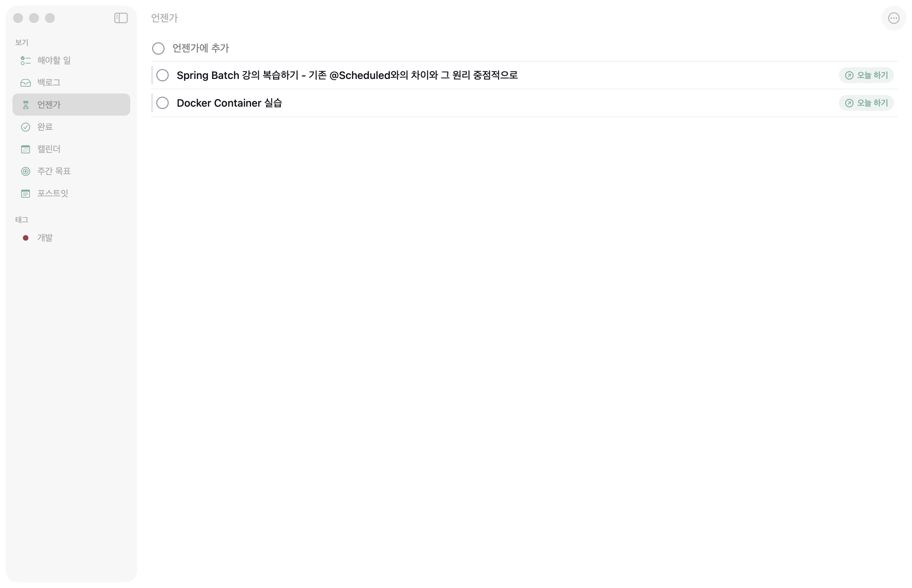 | 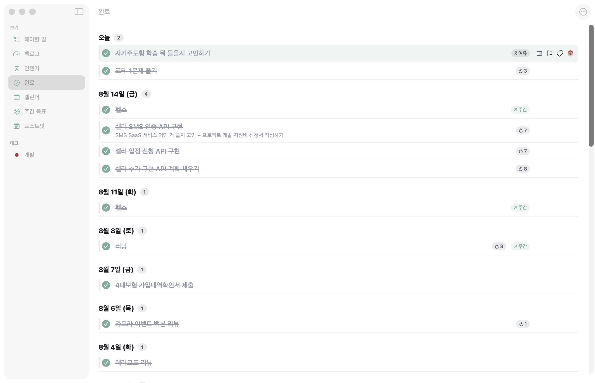 |

#### 캘린더 — 월 / 주 / 일

상단 세그먼트로 전환(오늘·◀·▶는 현재 뷰 단위로 이동). **월간·주간 모두 드래그로 일정
변경** — 월간은 셀 간, 주간은 7열 간(요일 순서는 시스템 캘린더의 주 시작 요일을 따른다).
날짜를 클릭하면 우측에 그 날의 상세 패널이 열리고(경계 드래그로 폭 조절), 하단 입력으로
그 날짜에 바로 추가할 수 있다. 월간·주간 헤더에는 그 주의 목표 진행 스트립. 일간은 전폭 리스트.

| 월간 — 셀당 여러 개 + "+N개" | 주간 — 7열 드래그 + 목표 스트립 |
|---|---|
| 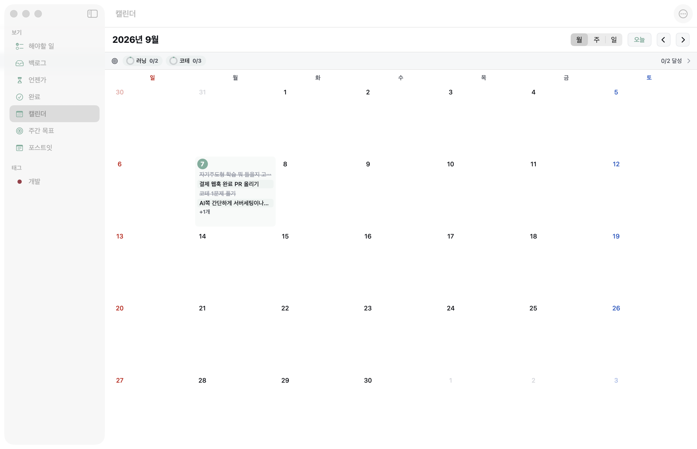 | 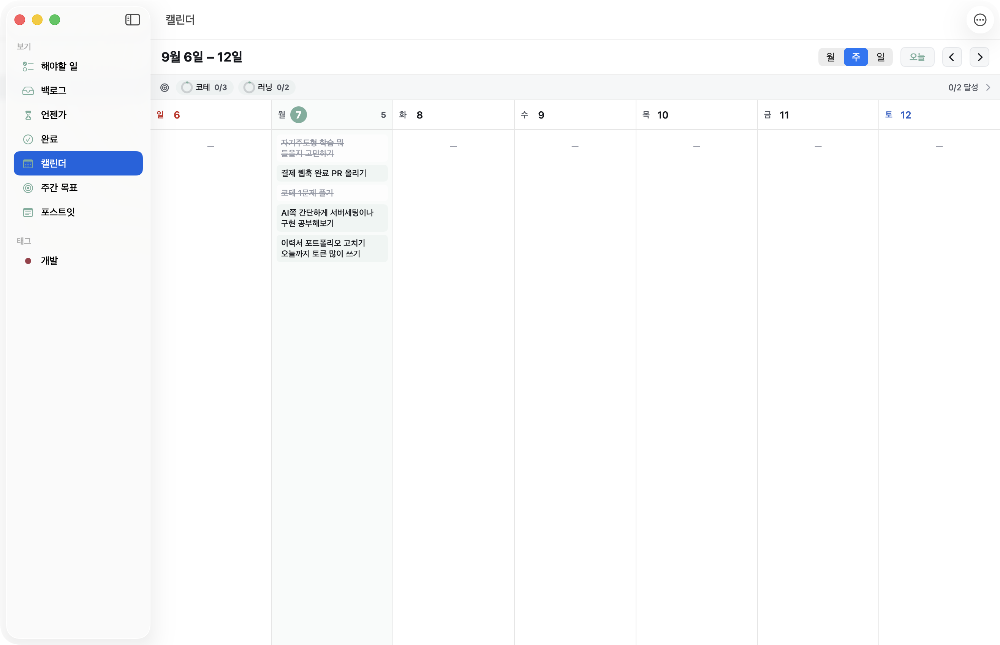 |

#### 주간 목표

"헬스 3회"(횟수형) · "책 1챕터"(단일형) 같은 목표를 **논리적 주**(기본 월요일 시작) 단위로
관리한다.

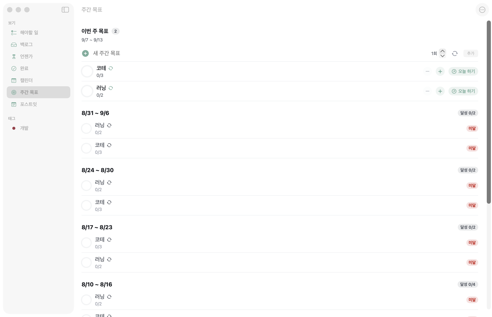

- **[오늘 하기]** → 오늘에 연결 task 생성(↗주간 배지). 그 task를 완료하면 진행도 자동 +1, 취소하면 -1. 다시 누르면 오늘에서 해제. 사이드바 · 해야할 일 요약 카드 · 브리핑 세 곳에서 조작할 수 있다.
- **루틴(↻)**: 매주 자동으로 0/n부터 재생성. 비루틴 미달 목표는 새 주 첫 브리핑의 '지난주 리뷰'에서 [잔여량만 이월 / 보류 / 종료]로 정리한다.
- 하단에는 지난 주들의 달성/미달 히스토리가 주별로 남는다.

### 메뉴바 팝오버

메뉴바 아이콘을 클릭하면 뜨는 첫 접점. **남은 N/M 헤더 + 오늘 할 일 빠른 체크 목록**
(우선순위 막대·태그 칩·이월 배지 포함)과 액션 버튼 6종 — 브리핑 열기 · 오버레이 토글 ·
새 포스트잇 · 메인 창 열기 · 설정 · 종료.

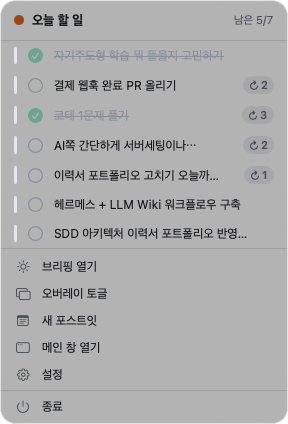

### 플로팅 오버레이 — ⌥⌘O

오늘 할 일만 담은 반투명 카드를 **모든 Spaces·전체화면 앱 위에** 띄운다. 클릭해도 지금
쓰던 앱의 포커스를 뺏지 않는다.

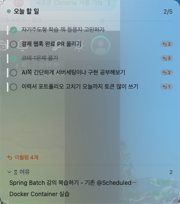

진행률 헤더, 자유 리사이즈, 하단에는 '언젠가'에서 몇 개를 꺼내 보여주는 **여유 칸**(개수는
설정에서) — 오늘 할 일을 다 끝내면 "여유가 있어요" 넛지로 강조된다. 클릭 규칙은
**체크 원 = 완료(1.5초 유예, 재클릭 취소) · 행/헤더 = 메인 창 열기**. 창 이동은 헤더 드래그,
행 드래그는 수동 정렬. 재시작 후 표시 여부·위치·크기 복원.

### 아침 브리핑 — 자동 · ⌥⌘T

논리적 오늘이 시작되면(앱 시작 / 잠자기 해제 / 기준 시각 도달) 하루 한 번 자동으로 뜨는
하루 시작 대시보드. 잠금 화면 중에는 표시를 보류했다가 잠금 해제 때 띄운다 — 못 본 채
소진되지 않는다.

- **어제 미완료 정리**: 항목마다 [오늘로 가져오기](↺n +1) / [백로그로 보류] / [버리기](삭제가 아닌 취소 보관).
- **오늘 할 일 체크**: 브리핑 안에서 바로 완료 처리.
- **이번 주 목표**: 진행 확인과 [오늘 하기] 토글.
- 새 주 첫 브리핑에는 **지난주 리뷰**가 붙는다 — 미달 목표를 이월/보류/종료로 정리.

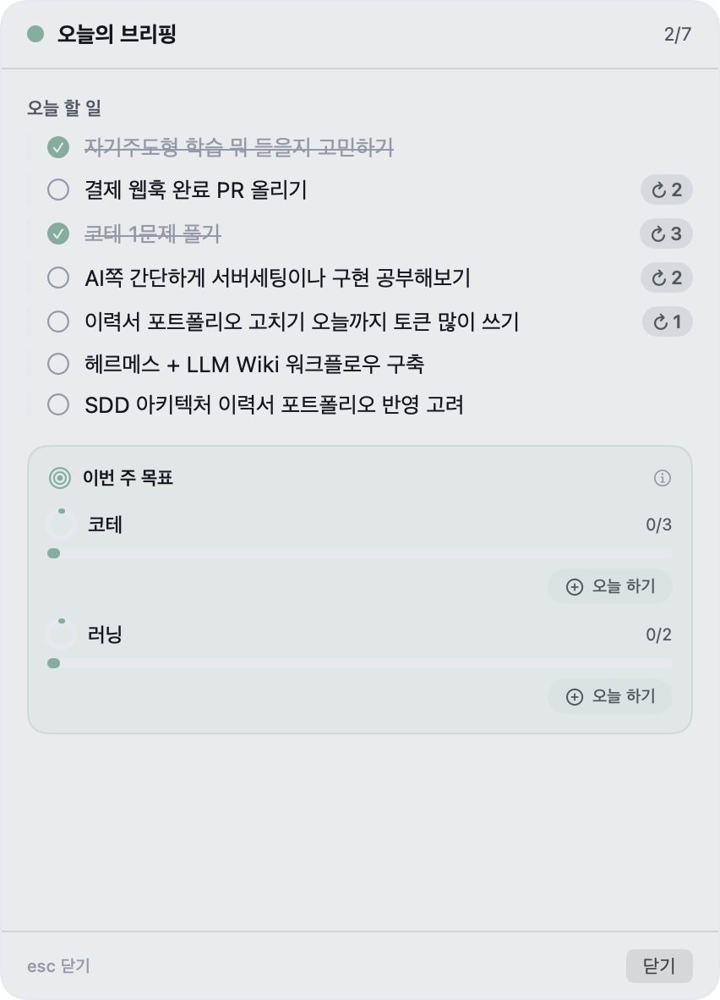

⌥⌘T는 하루 1회 판단과 무관하게 브리핑을 즉시 열고 닫는 토글이다.

### 빠른 추가 — ⌥⌘N

어떤 앱을 쓰고 있든 단축키 한 번으로 Spotlight식 입력창이 뜬다. 제목과 토큰을 섞어 쓰면
실시간으로 파싱되어 칩 행에 표시되고, Enter 시 토큰이 제거된 제목으로 저장된다.
(메인 창 인라인 추가 행도 같은 파서를 쓴다.)

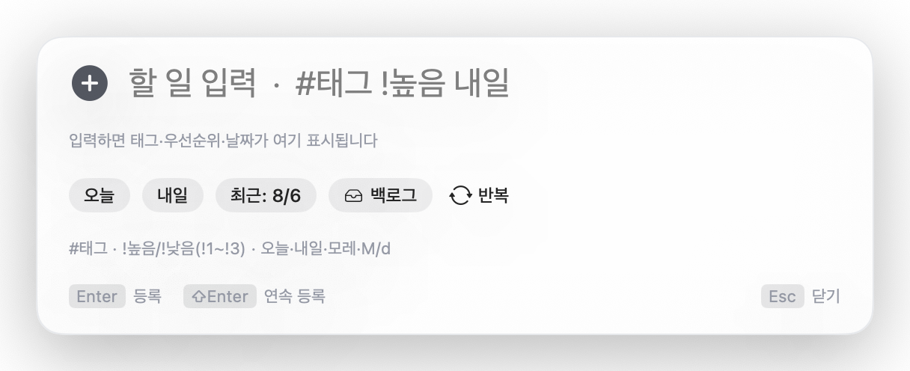

| 토큰 | 의미 |
|---|---|
| `#태그명` | 태그 지정. 입력 중 자동완성(부분일치), 없는 태그는 등록 시 생성. 공백 포함 태그명도 인식 |
| `!높음` `!보통` `!낮음` (또는 `!1` `!2` `!3`) | 우선순위. 여러 개면 마지막이 이김 |
| `오늘` `내일` `모레` | 상대 날짜 (논리적 하루 기준) |
| `M/d` `M월 d일` `M월d일` | 절대 날짜 — 이미 지난 날짜면 내년으로 해석 |

예: `보고서 초안 #업무 !높음 내일` → 제목 "보고서 초안", 태그 업무, 우선순위 높음, 내일.

빠른 버튼 행 **[오늘] [내일] [최근 M/d] [백로그] [반복]**으로도 지정할 수 있다 — 반복은
안 함/매일/평일/매주(요일 선택). **⇧Enter는 창을 유지한 채 연속 등록**, 빈 제목으로 Enter를
치면 조용히 닫히는 대신 경고 테두리로 입력 소실을 막는다.

### '언젠가' 패널 — ⌥⌘L

Due 없이 여유될 때 해나가는 일들의 집. 메인 창의 '언젠가' 뷰 외에, **⌥⌘L로 어디서든
플로팅 패널**을 띄워 확인·추가·완료·정렬·[오늘 하기]를 할 수 있다(위치·크기 기억, Esc로 닫기).

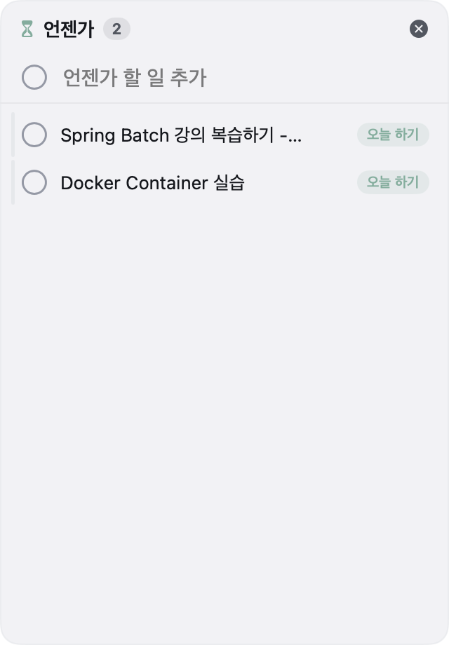

- 메인 창 '언젠가' 뷰에서는 **[오늘 하기] ↔ [오늘 있음] 왕복 토글** — 오늘로 꺼낸 항목도 목록에 남아 있어 한 번 더 누르면 되돌아간다.
- 꺼낸 항목이 오늘 안에 안 끝나면 **이월 대상이 되지 않고 조용히 '언젠가'로 복귀**한다 — ↺ 카운트도 오르지 않는다.
- '언젠가'는 의도적으로 날짜 없는 공간 — 메인 창의 인라인 추가에서 날짜 토큰은 무시된다.

### 포스트잇 — ⌥⌘S

투두와 별개의 빠른 메모 레이어. 노트마다 독립 플로팅 카드(자유 이동·리사이즈, 클래식
5색), **📌 핀**을 켜면 그 노트만 항상 위. ⌥⌘H로 열린 노트 전체를 표시/숨김. 닫으면 삭제가
아니라 보관 — 사이드바 '포스트잇' 뷰에서 날짜별로 조회·다시 열기(이전 위치·색·핀 그대로)·
다중 선택 삭제. 내용 없이 새로 만든 노트는 닫아도 보관하지 않는다.

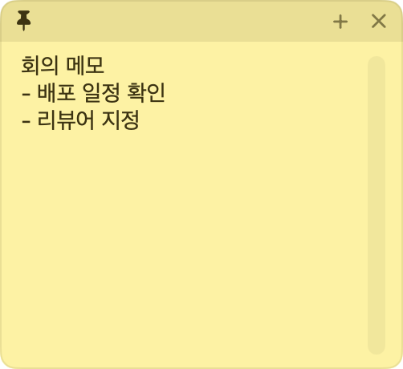

### 데스크톱 위젯

앱을 열지 않고 데스크톱/알림 센터에서 오늘 할 일을 본다. 3종 크기(작게 2개 · 중간 5개 ·
크게 10개 표시), **위젯의 체크 버튼으로 바로 완료 토글** — 반복 할 일의 다음 회차 생성,
주간 목표 진행도 반영까지 앱과 같은 코드 경로로 처리되고 앱과 실시간 양방향 동기화된다.
D-day 배지, 지난 할 일 빨간 표시, 높은 우선순위 점 포함.

위젯은 App Group이 필요해서 Xcode 빌드 산출물에만 포함된다 — [빌드 (직접)](#빌드-직접) 참고.

## 색상 테마

프리셋 9종(기본/세피아/포레스트/오션/라벤더/모노/하이콘트라스트/다크/미드나잇)을 고르거나,
아무 테마나 **복제해서 12색 슬롯**(배경/표면/텍스트/강조/D-day 등)을 직접 편집해 나만의
테마를 여러 개 저장한다. 강조색은 ColorPicker로 따로 지정. 변경은 앱 전역에 즉시 반영되고,
다크 팔레트면 시스템 크롬까지 다크로 전환된다(모노는 overdue 빨강만 남기고 전부 무채색).
모든 프리셋은 WCAG 대비 기준으로 검증돼 있다.

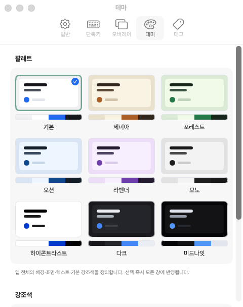

## 개념과 규칙

### 논리적 하루와 이월

이 앱의 하루는 자정이 아니라 **기준 시각(기본 09:00, 설정 가능)**에 시작한다. 새벽 2시에
작업 중이라면 아직 "어제"다. 기준 시각을 지나는 순간 열려 있는 모든 표면(메인 창·오버레이·
브리핑·메뉴바·위젯)이 새 날짜로 자동 갱신된다. 어제 미완료 작업은 브리핑에서 각각:

- **오늘로 가져오기** — `scheduledDate`를 오늘로, 이월 횟수 +1 (↺n 배지)
- **백로그로 보류** — 날짜 없는 백로그로 이동, 이월 이력 리셋
- **버리기** — 삭제가 아니라 '취소됨' 상태로 히스토리에 보관 (복구 가능)

↺n 배지는 **진짜 이월**에서만 오른다. 백로그로 보내는 모든 경로는 카운트를 0으로 리셋하고
— 백로그는 '미룬 날'이 없다 — '언젠가' 왕복은 아예 이력을 만들지 않는다.

### 반복 할 일

행 상세나 빠른 추가에서 **매일 / 평일 / 매주(요일 선택)** 규칙을 지정한다(↻ 배지).
완료를 확정하면 다음 회차가 자동 생성되고, 서브태스크는 미체크 상태로 복제된다.

### 자리를 기억한다

메인 창의 위치·크기·마지막 선택 뷰·사이드바 접힘, 캘린더 뷰 모드·우측 패널 폭, 오버레이·
브리핑·'언젠가' 패널의 위치·크기, 포스트잇 카드의 위치·색·핀까지 — 전부 저장되고 재시작
후 복원된다. 모니터 구성이 바뀌어 화면 밖이 된 창은 화면 안으로 자동 보정된다.

## 설정 항목

- **일반**: 로그인 시 자동 실행 / Dock 아이콘 표시 / 하루 기준 시각(기본 09:00) / 주 시작 요일(기본 월요일) / 메모 미리보기 표시
- **단축키**: 마스터 on/off → 개별 on/off + 재지정 → 예외 앱 목록(기본 JetBrains 계열)
- **오버레이**: 배경 불투명도 / 기본 카드 높이(줄 수) / 여유 칸 표시·개수
- **테마**: 프리셋 9종 + 커스텀 테마 편집기 + 강조색 ColorPicker
- **태그**: 이름·색상 관리

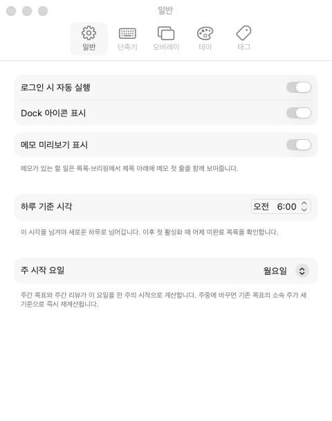

## 데이터 저장 위치

로컬 전용, 동기화 없음.

- 투두·태그·주간 목표: `~/Library/Application Support/AnhamDie/store.json`
  (위젯 포함 Xcode 빌드는 App Group 공유 컨테이너의 `AnhamDie/store.json`으로 자동 이전)
- 포스트잇: `~/Library/Application Support/AnhamDie/stickies.json`
- 설정: `UserDefaults` (`com.splguyjr.anhamdie`)

두 스토어 모두 스키마 버전과 손상 시 `.corrupt` 백업 규약을 갖고, 구버전 앱이 신버전
데이터를 덮어쓰지 못하게 저장을 거부한다.

## 빌드 (직접)

```bash
git clone https://github.com/splguyjr/anham-die.git && cd anham-die
bash Scripts/build-app.sh --install   # → ~/Applications/AnhamDie.app
open ~/Applications/AnhamDie.app
```

| 경로 | 요구사항 | 위젯 | 비고 |
|---|---|---|---|
| `Scripts/build-app.sh` | Command Line Tools만 | ✗ | ad-hoc 서명. brew cask가 쓰는 경로 |
| `Scripts/build-with-xcode.sh` | 정식 Xcode + XcodeGen(`brew install xcodegen`) + Xcode에 Apple ID 로그인(팀 ID) | ✓ | App Group 서명 포함, codesign seal 정상 |

`swift build -c release` → .app 번들 조립(LSUIElement, min macOS 15) → ad-hoc 서명 → 설치.
런타임 외부 의존성은 KeyboardShortcuts 하나(테스트 전용 swift-testing 별도). 테스트는 `swift test`.

> 참고: 1차 SPM 산출물은 KeyboardShortcuts 리소스 번들 위치 제약으로 codesign seal 검증에
> 실패하며, 이 경우 '로그인 시 자동 실행'(SMAppService)이 조용히 안 될 수 있다. 자동 실행이나
> 위젯이 필요하면 `Scripts/build-with-xcode.sh --install` 산출물을 쓰면 된다.

## 라이선스

MIT — [LICENSE](LICENSE) 참고.
